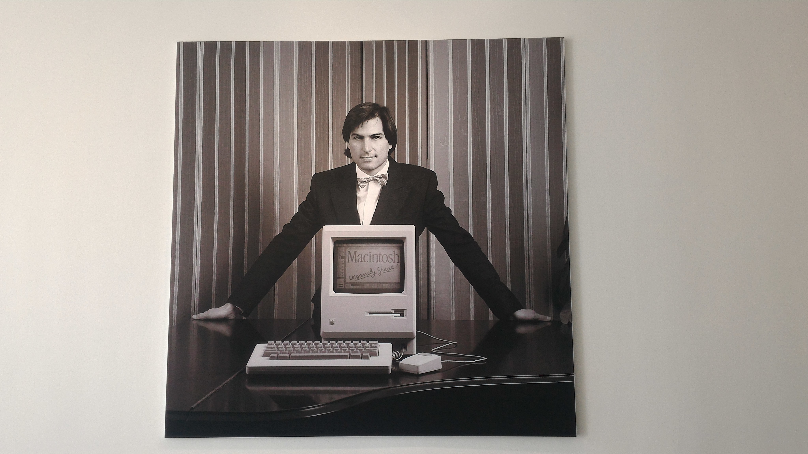

# 샌프란시스코 #1 - 오피스투어

* 경로

에버노트 - 페이스북 - 링크드인 - 애플 - 에어비앤비

## 1. 에버노트

※ 에버노트는 방문자의 사진 촬영이 금지되어 있습니다.

처음으로 방문한 에버노트는 1층에서 직원의 간단한 안내와 방문자 등록을 거친 후 입장 할 수 있었습니다.

1개의 건물을 10년 장기 임대하여 사용하고 있는 에버노트는 몇개의 층은 외부에 재임대를 하고 4,5층 2개를 사용하고 있었습니다.

회사의 사무실은 여타의 실리콘 밸리들 회사들처럼 OpenSpace 로 구성된 개인 업무 공간과 전신 투명 유리로 되어 있는 회의실을 볼 수 있었습니다. 또한 사무실 곳곳에 편안하게 소파에서 일할 수 있는 공간과 간식을 먹을 수 있는 공간이 있어 간단한 담소와 업무를 할 수 있도록 하였습니다.

사무실 분위기는 전체적으로 직원들 간의 커뮤니케이션에 많은 투자를 한다는 것을 느낄 수 있었습니다.

벽면은 언제든 펜을 쓸 수 있는 페인팅 벽면으로 되어있어 직원들이 벽면에 그림을 그리거나 메모를 쓸 수 있도록 하고 있고 핀을 박을 수 있는 고정대를 벽에 설치하여 팀에서 하는 업무나 자랑할만한 것을 핀으로 박아서 지나가는 사람들이 볼 수 있도록 하였습니다.

카페테리아에서는 직원들이 1시간마다 돌아가며 일일 바리스타를 함으로써 평소 얘기하기 힘든 직원들과 간단하게 얘기를 할 수 있도록 하고 있습니다.

모든 직원들이 공동으로 사용하는 식당의 입구에는 고객들의 칭찬을 들을 수 있도록 게시함으로써 제품에 대한 자부심을 키우는데 노력하는 모습도 보였습니다.

## 2. Facebook

※ 페이스북 또한 방문자의 내부 사무실 촬영을 가급적 자제할 것을 요청하였습니다.

과거 SUN Microsystems 의 건물을 재사용하는 Old Campus 와 직선형으로 새로 지은 새로운 Campus 는 멀리서도 Facebook 사무실임을 직감할 수 있을 정도로 큰 규모를 자랑하고 있습니다.

이미 건물 밖에서부터 Facebook 사무실 관광을 온 사람들로 북적거리는 이 곳은 곳곳에 볼거리로 가득차 있었습니다.

내부 직원의 안내를 따라 방문자 등록 후 따라 들어간 캠퍼스 내부는 오히려 마을이라는 말이 어울릴 정도로 장관을 이루었습니다. 특이한점은 내부 직원의 연결도 Facebook Tag 기능을 이용하였습니다.

**해커스 스퀘어** 로 불리는 이 곳은 멀리서 Hacker 라는 글이 새겨진 건물 벽면과 전 직원이 모여서 주요 인사들의 이야기를 나누거나 파티를 하는 공간으로 사용되며 대형 전광판을 통해서 여러가지 사내 행사를 안내 받을 수 있었습니다.

이곳을 통해서 사내 행사를 안내 받을 수 있습니다.

필즈커피와 오락실

IT 수리 센터 Temple Bar (교수대)

곳곳에는 손님들이 묵을 수 있는 숙소도 함께 제공되고 있었습니다.

저 멀리 보이는 해커 정신을 상징하는 해적 깃발

다양한 편의 시설이 제공되는 Old 캠퍼스에는 그외에도 손님들이 묵을 수 있는 레지던스와 디저트 카페, 케이터링 식당, 햄버거, 피자, 거리 곳곳에 바리스타들이 상주해 있었습니다. 10여분을 걸어야 끝을 만날 수 있을 정도로 긴 거리와 편의시설들은 5천명이 넘는 직원들에게 제공하기 위한 복지 정책으로 보여집니다.

1개 건물에 1~2개의 편의 공간이 있으며 나머지 공간은 실제론 업무용 공간이어서 편의시설 옆의 문으로 들어가면 실제 업무 공간이 있었습니다.

아쉬움을 뒤로 한 채 이동한 새로운 캠퍼스는 직원들이 쉽게 필요한 공간을 찾을 수 있도록 하고 있었습니다. 직원의 Desk 위치를 찾을 수 있도록 한다든지 내부 안내판이 곳곳에 위치되어 있었습니다.

안내도와 Mark Zuckerberg 는 찾을 수 없다는 아쉬움의 안내

다양성을 존중하고 배려하는 Facebook 답게 Baby Care Room 이 별도로 제공되어 있습니다.

SUN Microsystems 의 사례를 잊지말자며 그 자취를 남긴 Facebook 의 간판

Old 캠퍼스와 신규 캠퍼스는 분리되어 있지만 실제로는 지하도로 다닐 수 있으며 빠르게 이동할 수 있게 트램과 직원용 자전거를 별도로 제공하고 있었습니다. 수많은 직원들이 오고가기 때문에 이를 위한 교통가이드가 배치되어 있을 정도로 많은 신경을 쓰고 있었습니다.

페이스북의 전체적인 분위기는 하나의 관광용 마을을 온 듯한 착각이 들만큼 다양하고 많으며 큰 공간을 할애했다는 것에 압도되었습니다. 또한 직원들이 업무에만 집중 할 수 있도록 많은 부분을 지원한다는 것을 느낄 수 있었습니다. 잘 알려진 사무용 기기를 자판기에서 뽑아서 쓸 수 있도록 한다든지 캠퍼스 이동간에 트램과 자전거를 제공한다거나 Valet Parking 을 할 수 있도록 직원이 별도로 있습니다. 방문자도 이용할 수 있다고 합니다.

업무외의 시간 소비을 최소화 하기 위해 효율적으로 공간을 배치하고 이 때문에 지루해 질 수 있는 업무 공간을 좀 더 Fun하게 꾸며서 언제나 회사를 즐거운 공간으로 만들고자 하는 노력을 느낄 수 있었습니다.

## 3. LinkedIn

※ LinkedIn 역시 사내 촬영이 금지되어 있습니다.

방문자 등록 후 내부 직원을 연결해달라는 요청한 뒤 안내를 받을 수 있었습니다. 총 3개의 시설로 나뉘어진 LinkedIn 은 2개의 업무공간과 1개의 편의 시설로 나뉘어져 있었습니다.

10년을 훌쩍 넘긴 LinkedIn 의 성장 스토리를 한 눈에 볼 수 있는 T-Shirts 프린팅

50M-150M 사용자 축하 사진 (안내해주신분은 100M 촬영때 부터 있었으나 150M 때는 식당에 있어서 별도로 연락을 못 받아 함께 하질 못해 아쉬웠다고 합니다.)

직원분과 함께 찍은 LinkedIn 환영 간판

사무실의 전체적인 분위기는 다소 보수적으로 보였으나 직원들과 간단한 대화를 하는 모습에서는 다른 실리콘 밸리와 다를바 없는 수평적이고 재미있는 곳임을 느낄 수 있었습니다.

## 4. Apple

※ 방문한 곳 중 가장 보안이 철저한 곳이었으며 단 1개의 공간(10m 남짓)을 제외하고는 촬영이 불가하였습니다.

방문자가 들어갈 수 있는 유일한 장소
원형으로 건물을 만들었기 때문에 무한 반복이라는 의미에서 지은 건물명이라고 합니다.

입구에 들어서자마자 들어간 비지니스 공간은 소파와 여러 회의실이 함께 있는 공간이었습니다. 특이한 점은 그 공간에 큰 나무가 2그루 있는데 올리브 나무라고 합니다. 함께 방문한 사람들은 모두 "애플이니까 사과 나무인가보다." 라고 했다가 실소를 내었습니다.

그 이후 넓은 잔디밭이 등장하는데 주로 파티나 콘서트를 여는 장소로 사용된다고 합니다. 식당은 항상 사과가 배치되어 있으나 현재 수급의 어려움으로 일시적으로 중단하였다고 합니다.

마지막으로 방문한 공간은 생전 Steve Jobs 의 모습이 그려진 공간이었으며 Steve Jobs 가 매우 아끼던 팀에 사줬던 그랜드 피아노가 있는 곳이었습니다.

Steve Jobs 의 생전 모습

Steve 와 함께...

사무실을 볼 수 없는 아쉬움이 있었지만 한국인 #1 직원( - 한국 국적자 중)이었던 분에게서 여러 이야기를 들을 수 있었습니다.

전 직원을 대상으로 중요한 말을 할 때에는 언제나 식당에 직원을 모아서 책상위로 올라가서는 연설을 했다는 Steve Jobs 에 대한 이야기. 언제나 열정이 넘치는 사람으로 기억된다며 잘하는 사람에게는 아낌없는 지원을, 못하는 사람에게는 가차없는 냉정함을 보여주었다고 합니다.

사무실은 매니저는 1인 1실이 제공되며 실무자에게는 2인 1실이 제공된다고 하였습니다. 간혹 큐비클 동료가 휴가나 출장을 가게 되면 매우 편안한 업무를 느낄 수 있다고 하였습니다.

## 5. Airbnb

※ 방문한 모든 오피스를 통틀어 가장 촬영이 수월했던 곳이었습니다.

Airbnb 는 도심 내부의 슬럼가 근처에 위치하며 도심정화 정책에 일조하고자 젠가와 함께 사무실을 이동한 것으로 유명합니다.

마찬가지로 간단한 방문자 등록 후 안내를 받을 수 있었습니다. 입구에서부터 장관을 이룬 나뭇잎 벽면은 큰 기대를 가지게 하였습니다.

Airbnb 는 고객들의 Host 중에서도 인기 Host 들의 집을 그대로 옮겨놓아 사무실을 꾸몄습니다. 실제로도 사무실이라기보단 가정집 같은 분위기를 많이 풍기며 나무 벽면과 밝은 온도의 조명을 이용하여 집에서 일한다는 착각이 들 정도로 독특한 분위기를 냈습니다.

크든 작든 모든 공간이 이렇게 꾸며져 있었으며 각 나라의 유명 Host 를 장식 하나하나를 그대로 옮겨놓을 정도로 이루어져 있습니다.

Airbnb 가 재정적 어려움에 처했을 때 궁여지책으로 판매했다는 씨리얼

1호 Host 의 집을 옮겨놓은 회의실

화장실마저 위트가 느껴지는 Airbnb (I am Groot 라머 오소리 밑 나무)

Airbnb 의 사무실의 전체적인 느낌은 사무실인듯 아닌듯 가정집 같은 사무실이었습니다. Facebook 이 일부 공간의 활용에 집중했다면 Airbnb 는 내부 공간의 꾸미기에 어마어마한 투자를 했음을 알 수 있었습니다.

특이한게 2~3인용 회의실이 극도로 많음을 느낄 수 있었는데 이유를 물으니 업무상 큰 회의보다는 작은 회의가 많기 때문에 그렇게 했다는 것이 인상적이었습니다.

## 6. Google Office - San Francisco

GDG Summit 행사 전날 Dinner Party 에 초대되어 간접적으로 사무실을 볼 수 있었습니다.

베이브릿지를 바로 볼 수 있는 곳에 위치한 Google 사무실

식당에서 다양한 국적의 GDG 멤버들을 만날 수 있는 영광을 누렸습니다.

베이브릿지 두들이 있는 구글 로고와 함께

## 오피스 투어를 마무리하며

실리콘 밸리의 회사들 중 5곳을 방문하였는데 이 곳에서 가장 크게 느낀 점은 모두가 업무의 효율성을 극대화에 공간도 예외일 수 없음을 느낄 수 있었습니다. 또한 이런 극대화가 자칫 사무실에서 지루함을 더해질 수도 있지만 이를 최소화 하기 위해 각 회사들마다 여러가지 자구책을 제시하고 있음을 느낄 수 있었습니다.

에버노트는 각자의 팀에서 하는 일에 대해 모두에게 알릴 수 있는 플랭카드나 업무 판넬을 보여주며 4-5층을 뚫어서 커뮤니케이션과 지루한 업무 공간에 변화를 시도했습니다.

페이스북은 사무실을 하나의 마을처럼 꾸며 재미있는 공간을 만들고자 했으며 링크드인 또한 회의실을 게임명으로 하거나 명품 브랜드명으로 하기도 하고 곳곳에 회사의 역사와 상징하는 기념물을 거부감없이 볼 수 있도록 하였습니다.

에어비앤비는 말할 것도 없이 사무실 그 자체가 휴식공간임을 느낄 수 있게 했습니다.

그들이 수평적인 문화와 빠르게 성장할 수 있는 비결이 비단 그들만의 문화가 아닌 이 문화를 유지하기 위해 물리적인 것까지도 변화를 시도하는 모습들에 처음부터 끝까지 감탄을 자아냈습니다.

만약 여러분들도 San Francisco 를 여행 올 계획이라면 지인들을 통해 여러 회사를 방문해서 그들의 문화를 사무실 공간에서도 느낄 수 있음을 알아보시길 추천합니다.
