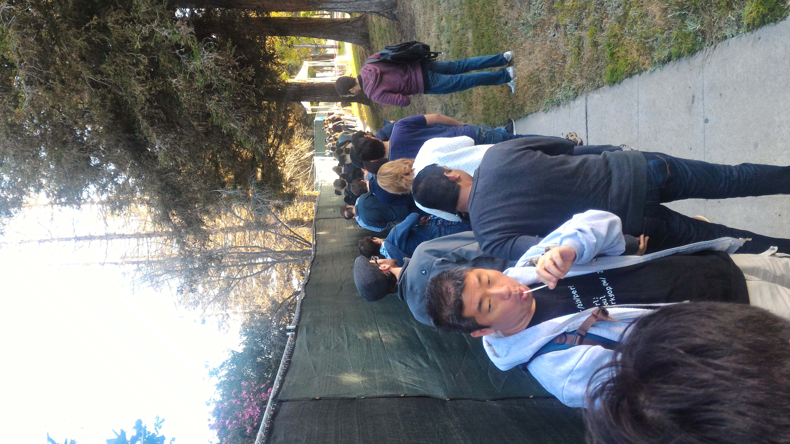
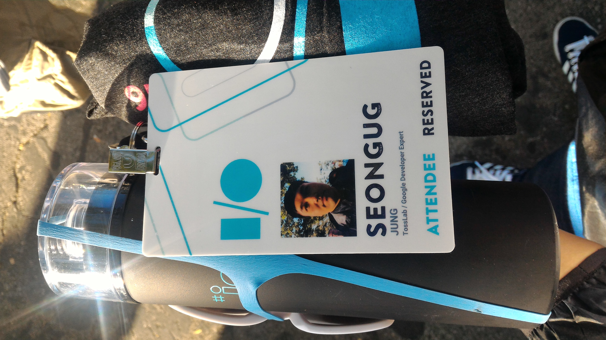
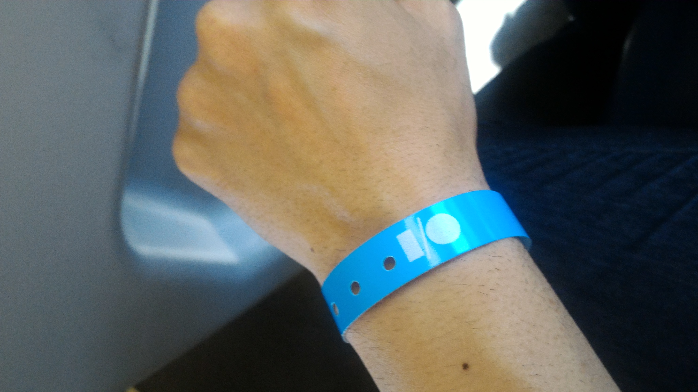
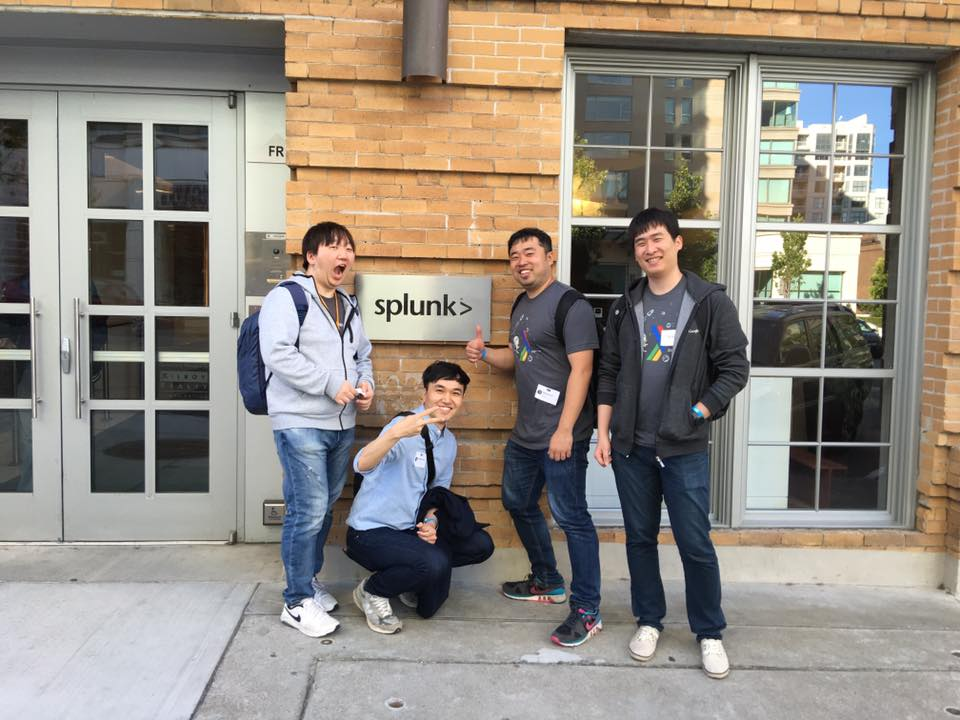
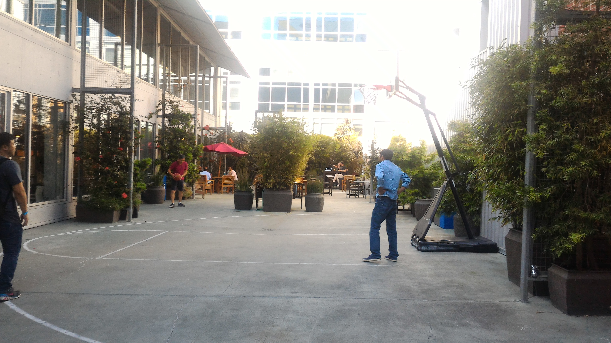
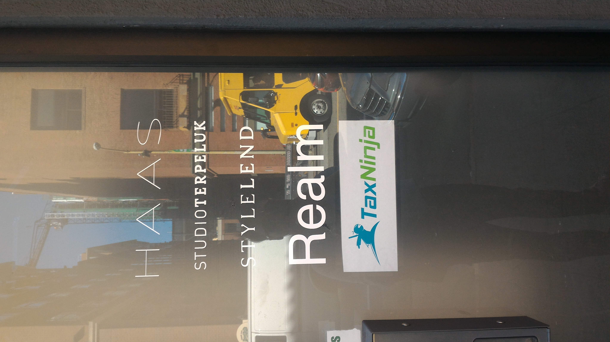
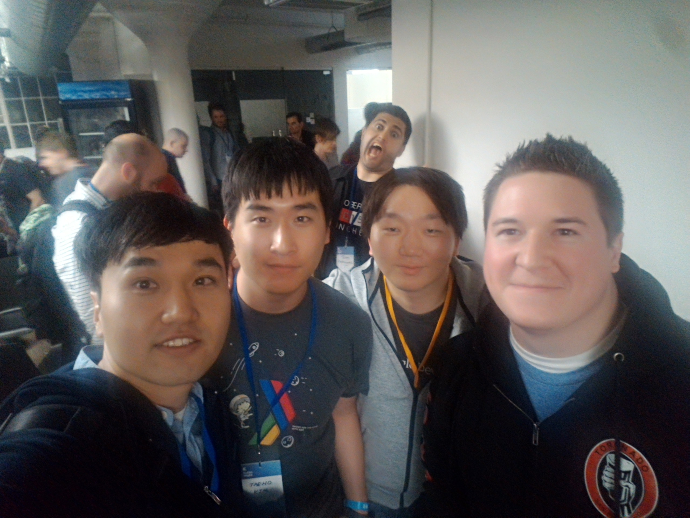

# San Francisco 행사

## 1. Google IO 등록

Keynote 의 앞자리를 얻기 위해서는 선착순으로 등록을 해야하기 때문에 등록이 시작되는 아침 일찍부터 이미 줄선 사람들로 가득하였습니다.

많은 사람들이 등록한 후 제 차례가 되서야 한 등록은 매우 간단하게 끝났습니다.

비니모자, 텀블러, 카드보드, 태그 카드 (전 GDE 라서 Reserved 참여자입니다)

손목의 팔찌는 After Party 콘서트 참석을 위한 확인증입니다. (클럽 팔찌 아닙니다 ㅋㅋ)

오전에 간단한 휴식을 취하고 오후에 뒤늦게 현지의 행사들을 쫓아다녔습니다.

## 2. Splunk

오후에 첫 코스는 데이터 분석으로 유명한 Splunk 의 오피스 투어였습니다.

사내의 모습은 여타 실리콘밸리들처럼 넓고 자유로운 공간과 쉼터가 공존하는 모습을 가지고 있었습니다.

사무실의 한켠에 마련된 농구장이 매우 인상적이였습니다.

사내에서 직원들끼리 모여 NBA 농구를 시청하는가 하면 카트를 타고 사무실을 돌아다니는 모습 또한 인상적이었습니다. 사무실에 하나 놔둬서 카페테리아와 자리를 오갈때 쓰고 싶다는 생각이 들더군요.

## 3. Realm-Kotlin Party

오후 7시에는 Realm, JetBrain, Netflex 에서 주관한 개발자 파티에 참석하였습니다.
Realm 에서 재직 중인 김용욱님의 도움을 받아 쉽게 입장할 수 있었습니다.

다른 회사와 함께 입주해 있는 Realm

현지의 직원 말씀으로는 비교적 크게 열린 미트업으로써 굉장히 고품질의 세미나가 진행되는 것이라고 하였습니다.
실제로 현지에서 들은 세션은 발표 내내 모두 감탄과 박수 갈채가 쏟아지며 놀라움을 금치 않을 수 없었습니다.

세션 발표자와 한 컷. Jake Wharton

## 마무리

현지에서 경험한 미트업은 굉장히 인상적이었습니다. 실제로 웹에서 유명한 세션 발표자의 내용을 직접 듣고 그들과 교류할 수 있다는 것이 매우 흥미로웠으며 굉장한 고품질의 테크 세미나가 볼 수 있다는 것 자체가 개발자들에겐 천국과도 같은 곳이었습니다.

특히 골목을 돌면 Github, Docker, Splunk 등등 인터넷으로만 만나는 회사가 곳곳에 배치되어 있어 신기하기 그지 없었습니다.
현지인의 말로는 이게 무서운게 이직을 원하면 Break Time 에 면접 보기를 자주 한다고 합니다.

실리콘 밸리가 이직이 잦은 이유가 이런 군집형태의 탓인 것 같기도 합니다.